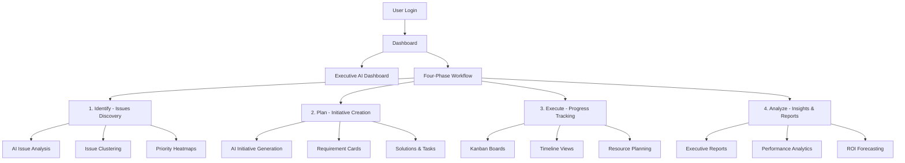

# FlowVision Architecture Guide

_Comprehensive Technical Documentation & Team Onboarding_

Generated: January 13, 2025

---

## 🎯 **EXECUTIVE OVERVIEW**

FlowVision is an **AI-Powered Efficiency Intelligence Platform** built specifically for Architecture & Engineering firms. The system follows a modern, cloud-ready architecture with TypeScript, Next.js, and PostgreSQL, designed to scale and handle complex project management workflows.

### **Core Philosophy**

- **User-Centric Design**: Every feature serves the Morrison A&E team's actual workflow
- **AI-First Intelligence**: Augment human decision-making with confident AI recommendations
- **Data-Driven Insights**: Transform process bottlenecks into strategic advantages
- **Professional Quality**: Enterprise-grade security, performance, and reliability

---

## 🏗️ **SYSTEM ARCHITECTURE**

### **Technology Stack**

```
┌─────────────────────────────────────────────────────────────┐
│                        CLIENT LAYER                         │
├─────────────────────────────────────────────────────────────┤
│ React 18 + Next.js 14 (App Router)                        │
│ TypeScript + Tailwind CSS + React Beautiful DnD           │
│ NextAuth.js + React Hook Form + Zod Validation            │
└─────────────────────────────────────────────────────────────┘
┌─────────────────────────────────────────────────────────────┐
│                      API/SERVICE LAYER                      │
├─────────────────────────────────────────────────────────────┤
│ Next.js API Routes (Serverless Functions)                 │
│ OpenAI GPT-4 Integration + Custom AI Engines              │
│ RBAC Security + Input Validation + Error Handling         │
└─────────────────────────────────────────────────────────────┘
┌─────────────────────────────────────────────────────────────┐
│                       DATA LAYER                           │
├─────────────────────────────────────────────────────────────┤
│ PostgreSQL 16 + Prisma ORM + Database Migrations          │
│ Docker Containerization + Environment Isolation           │
│ Comprehensive Logging + Audit Trails + Analytics          │
└─────────────────────────────────────────────────────────────┘
```

### **Application Flow Architecture**



---

## 📁 **PROJECT STRUCTURE**

### **Directory Organization**

```
FlowVision/
├── 📱 app/                     # Next.js 14 App Router
│   ├── 🔐 auth/               # Authentication pages
│   ├── 🎯 executive/          # AI-powered executive dashboard
│   ├── 🔍 issues/             # Issue identification & clustering
│   ├── 💡 ideas/              # Idea management & collaboration
│   ├── 🏗️ initiatives/        # Initiative planning & management
│   ├── 📋 solutions/          # Solution detail pages
│   ├── 📊 track/              # Progress tracking & monitoring
│   ├── 🗺️ roadmap/            # Timeline & milestone planning
│   ├── 👤 profile/            # User profile & preferences
│   └── 🔌 api/                # Backend API endpoints
│       ├── 🤖 ai/             # AI-powered features
│       ├── 👥 users/          # User management
│       ├── 🏢 teams/          # Team & collaboration
│       ├── 📈 analytics/      # Data insights & reporting
│       └── 🔧 admin/          # System administration
│
├── 🧩 components/             # Reusable React components
│   ├── 🤖 ai/                 # AI-specific components
│   ├── 🗺️ roadmap/            # Timeline & planning components
│   └── 📋 [Feature]Board.tsx  # Feature-specific boards
│
├── 📚 lib/                    # Core utilities & configurations
│   ├── 🔐 auth.ts             # NextAuth configuration
│   ├── 🗄️ prisma.ts           # Database client
│   ├── 🤖 openai.ts           # AI service integration
│   ├── 🛡️ rbac.ts             # Role-based access control
│   └── 📊 logger.ts           # Comprehensive logging
│
├── 🗄️ prisma/                 # Database management
│   ├── 📄 schema.prisma       # Database schema definition
│   ├── 🔄 migrations/         # Database migration history
│   └── 🌱 seed-*.cjs          # Database seeding scripts
│
├── 🧪 tests/                  # Comprehensive testing suite
├── 📋 scripts/                # Automation & utility scripts
├── 📖 docs/                   # Additional documentation
└── 🔧 [Config Files]          # TypeScript, ESLint, Tailwind, etc.
```

---

## 🔌 **API ARCHITECTURE**

### **RESTful API Design**

All API endpoints follow consistent patterns with proper HTTP methods, status codes, and error handling:

```typescript
// Standard API Response Format
interface APIResponse<T> {
  success: boolean;
  data?: T;
  error?: string;
  message?: string;
  meta?: {
    pagination?: PaginationInfo;
    stats?: Record<string, any>;
  };
}
```

### **Core API Endpoints**

| **Category**       | **Endpoint**                      | **Purpose**                      | **Methods**            |
| ------------------ | --------------------------------- | -------------------------------- | ---------------------- |
| **Authentication** | `/api/auth/*`                     | User authentication & sessions   | GET, POST              |
| **Users**          | `/api/users`                      | User management & profiles       | GET, POST, PUT         |
| **Issues**         | `/api/issues`                     | Issue discovery & clustering     | GET, POST, PUT         |
| **Initiatives**    | `/api/initiatives`                | Initiative planning & management | GET, POST, PUT, DELETE |
| **Solutions**      | `/api/initiatives/[id]/solutions` | Solution implementation          | GET, POST, PUT, DELETE |
| **Tasks**          | `/api/solutions/[id]/tasks`       | Task management & tracking       | GET, POST, PUT, DELETE |
| **AI Services**    | `/api/ai/*`                       | AI-powered features & analysis   | POST                   |
| **Analytics**      | `/api/analytics/*`                | Performance insights & reporting | GET                    |
| **Executive**      | `/api/executive/*`                | Executive dashboard data         | GET                    |

### **AI Integration Architecture**

```typescript
// AI Service Configuration
interface AIServiceConfig {
  provider: 'openai' | 'custom';
  model: string;
  temperature: number;
  maxTokens: number;
  confidenceThreshold: number;
}

// AI Response Format
interface AIResponse {
  content: string;
  confidence: number;
  reasoning?: string;
  metadata: {
    model: string;
    tokens: number;
    timestamp: string;
  };
}
```

---

## 💾 **DATABASE ARCHITECTURE**

### **Core Data Models**

```prisma
// Key Prisma Models Overview
model User {
  id       String @id @default(cuid())
  email    String @unique
  name     String
  role     Role   @default(MEMBER)
  // ... relationships and metadata
}

model Initiative {
  id              String @id @default(cuid())
  title           String
  problem         String
  goal            String
  status          InitiativeStatus
  progress        Int @default(0)
  solutions       InitiativeSolution[]
  requirementCards RequirementCard[]
  // ... timeline, metrics, AI fields
}

model InitiativeSolution {
  id          String @id @default(cuid())
  title       String
  description String
  type        SolutionType
  status      SolutionStatus
  tasks       SolutionTask[]
  // ... cost, timeline, AI fields
}

model SolutionTask {
  id           String @id @default(cuid())
  title        String
  status       TaskStatus
  priority     Int
  progress     Int @default(0)
  // ... assignments, dependencies, AI fields
}
```

### **Data Relationships**

```
User (1) ──── (N) Initiative
Initiative (1) ──── (N) InitiativeSolution
InitiativeSolution (1) ──── (N) SolutionTask
Initiative (1) ──── (N) RequirementCard
Issue (N) ──── (1) IssueCluster
Initiative (N) ──── (1) IssueCluster
```

---

## 🎨 **USER INTERFACE ARCHITECTURE**

### **Design System**

FlowVision uses a custom design system built on Tailwind CSS with consistent patterns:

```typescript
// Design Tokens
const designTokens = {
  colors: {
    primary: 'blue-600',
    secondary: 'gray-600',
    success: 'green-600',
    warning: 'yellow-600',
    error: 'red-600',
  },
  spacing: '1.5rem', // 24px base unit
  typography: 'Inter font family',
  components: 'Card-based layouts',
  animations: 'Subtle transitions & hover effects',
};
```

### **Component Architecture**

```typescript
// Reusable Component Pattern
interface ComponentProps {
  data: DataType[];
  loading?: boolean;
  error?: string;
  onAction?: (item: DataType) => void;
  aiLoading?: boolean;
  onGenerateWithAI?: () => void;
}

// Standard Board Component Structure
export default function FeatureBoard({
  data,
  loading,
  error,
  onAction,
  aiLoading,
  onGenerateWithAI,
}: ComponentProps) {
  // State management
  // Data fetching
  // Event handlers
  // Render logic with loading/error states
}
```

---

## 🤖 **AI INTEGRATION ARCHITECTURE**

### **AI Service Layer**

```typescript
// AI Service Interface
interface AIService {
  isConfigured(): boolean;
  generateInitiative(context: InitiativeContext): Promise<AIResponse>;
  analyzePriority(initiatives: Initiative[]): Promise<PriorityAnalysis>;
  clusterIssues(issues: Issue[]): Promise<ClusterResult>;
  generateSolutions(initiative: Initiative): Promise<Solution[]>;
  generateTasks(solution: Solution): Promise<Task[]>;
}
```

### **AI Confidence & Quality System**

- **Confidence Scores**: 0-100% for all AI-generated content
- **Human Review**: All AI suggestions require human approval
- **Audit Trails**: Complete history of AI decisions and reasoning
- **Fallback Modes**: Graceful degradation when AI services unavailable

---

## 🔐 **SECURITY ARCHITECTURE**

### **Authentication & Authorization**

```typescript
// Role-Based Access Control
enum Role {
  ADMIN = 'ADMIN', // Full system access
  LEADER = 'LEADER', // Team management + creation
  MEMBER = 'MEMBER', // Read-only + assigned tasks
}

// Permission Checking
function hasPermission(user: User, action: Action, resource: Resource): boolean {
  return rbac.check(user.role, action, resource);
}
```

### **Security Features**

- **NextAuth.js**: Industry-standard authentication
- **JWT Tokens**: Secure session management
- **Input Validation**: Zod schemas for all API inputs
- **SQL Injection Protection**: Prisma ORM prevents direct SQL
- **XSS Protection**: React's built-in escaping + CSP headers
- **CSRF Protection**: Built into NextAuth.js

---

## 📊 **FEATURE COMPLETENESS MATRIX**

### **✅ FULLY IMPLEMENTED FEATURES**

| **Phase**     | **Feature**           | **API** | **UI** | **AI** | **Status** |
| ------------- | --------------------- | ------- | ------ | ------ | ---------- |
| **Executive** | AI Dashboard          | ✅      | ✅     | ✅     | 🟢 Live    |
| **Executive** | Health Scores         | ✅      | ✅     | ✅     | 🟢 Live    |
| **Executive** | ROI Forecasting       | ✅      | ✅     | ✅     | 🟢 Live    |
| **Identify**  | Issue Discovery       | ✅      | ✅     | ❌     | 🟢 Live    |
| **Identify**  | Issue Clustering      | ✅      | ✅     | ✅     | 🟢 Live    |
| **Identify**  | Priority Heatmaps     | ✅      | ✅     | ✅     | 🟢 Live    |
| **Plan**      | Initiative Creation   | ✅      | ✅     | ✅     | 🟢 Live    |
| **Plan**      | Requirement Cards     | ✅      | ✅     | ✅     | 🟢 Live    |
| **Plan**      | Solutions Management  | ✅      | ✅     | ⚠️     | 🟢 Live    |
| **Plan**      | Task Breakdown        | ✅      | ✅     | ⚠️     | 🟢 Live    |
| **Execute**   | Progress Tracking     | ✅      | ✅     | ❌     | 🟢 Live    |
| **Execute**   | Roadmap Planning      | ✅      | ✅     | ❌     | 🟢 Live    |
| **Execute**   | Team Collaboration    | ✅      | ✅     | ❌     | 🟢 Live    |
| **Analyze**   | Audit Logging         | ✅      | ✅     | ❌     | 🟢 Live    |
| **Analyze**   | Performance Analytics | ✅      | ✅     | ✅     | 🟢 Live    |

**Legend**: ✅ Complete | ⚠️ Partial | ❌ Not Implemented | 🟢 Live | 🟡 Testing | 🔴 Issues

---

## 🚀 **DEPLOYMENT ARCHITECTURE**

### **Development Environment**

```bash
# Quick Start Commands
npm install                    # Install dependencies
docker-compose up -d          # Start PostgreSQL database
npx prisma migrate deploy     # Apply database migrations
npm run prisma:seed          # Load comprehensive demo data
npm run dev                  # Start development server (localhost:3001)
```

### **Production Readiness**

- **Docker Support**: Full containerization for consistent deployments
- **Environment Variables**: Secure configuration management
- **Database Migrations**: Automated schema updates
- **Health Checks**: Built-in monitoring endpoints
- **Error Tracking**: Comprehensive logging and error reporting
- **Performance Monitoring**: Response time and usage analytics

---

## 👥 **TEAM ONBOARDING**

### **Developer Quick Start**

1. **Clone & Setup**

   ```bash
   git clone [repository]
   cd FlowVision
   npm install
   ```

2. **Environment Configuration**

   ```bash
   cp .env.example .env.local
   # Configure DATABASE_URL, NEXTAUTH_SECRET, etc.
   ```

3. **Database Setup**

   ```bash
   docker-compose up -d
   npx prisma migrate deploy
   npm run prisma:seed
   ```

4. **Development Server**
   ```bash
   npm run dev
   # Visit http://localhost:3001
   ```

### **Testing & Quality**

```bash
# Code Quality
npm run lint              # ESLint + TypeScript checking
npm run format           # Prettier code formatting
npm test                 # Jest unit tests
npm run test:e2e         # Cypress integration tests

# Database Management
npx prisma studio        # Visual database browser
npx prisma generate      # Update Prisma client
npx prisma db push       # Push schema changes (dev only)
```

---

## 🔧 **MAINTENANCE & MONITORING**

### **Performance Monitoring**

```typescript
// Built-in Performance Tracking
interface PerformanceMetrics {
  apiResponseTimes: Record<string, number>;
  pageLoadTimes: Record<string, number>;
  aiServiceLatency: number;
  databaseQueryTimes: Record<string, number>;
  userSessionMetrics: UserEngagement;
}
```

### **Health Check Endpoints**

- `GET /api/health` - Basic service health
- `GET /api/admin/stats` - System performance metrics
- `GET /api/admin/ai/performance` - AI service status

---

## 📚 **EXPERT PROFILES INTEGRATION**

FlowVision leverages a comprehensive **Expert Profiles System** for consistent decision-making:

### **Key Expert Roles**

- **Technical Architect**: System design and scalability decisions
- **AI Architect**: Machine learning and AI integration strategy
- **UX Strategist**: User experience and interface design
- **Security Architect**: Security protocols and compliance
- **A&E Industry Specialist**: Domain-specific requirements and workflows

### **Quality Gates**

Each major feature follows expert-defined quality gates ensuring:

- **Technical Excellence**: Performance, scalability, maintainability
- **User Experience**: Intuitive interfaces and efficient workflows
- **Security Compliance**: Enterprise-grade security standards
- **AI Responsibility**: Ethical AI implementation with human oversight

---

## 🎯 **NEXT DEVELOPMENT PRIORITIES**

### **Sprint 5-10 Roadmap**

1. **Enhanced AI Integration** (Sprint 5)
   - Solution generation AI
   - Task breakdown AI
   - Intelligent resource allocation

2. **Advanced Analytics** (Sprint 6-7)
   - Predictive project timelines
   - Risk assessment algorithms
   - ROI optimization recommendations

3. **Collaboration Features** (Sprint 8-9)
   - Real-time updates
   - Comment systems
   - Notification engine

4. **Integration Ecosystem** (Sprint 10+)
   - Third-party tool integrations
   - API for external services
   - Mobile application support

---

## 📞 **SUPPORT & RESOURCES**

### **Documentation Links**

- [Expert Profiles System](./EXPERT_PROFILES_SYSTEM.md)
- [Systems Enhancement Plan](./SYSTEMS_ENHANCEMENT_EXECUTION_PLAN.md)
- [Demo Accounts Guide](./DEMO_ACCOUNTS_GUIDE.md)
- [Comprehensive Seed Analysis](./COMPREHENSIVE_SEED_ANALYSIS_REPORT.md)

### **Getting Help**

- **Technical Issues**: Check logs at `/logs` directory
- **Database Issues**: Use `npx prisma studio` for visual inspection
- **AI Service Issues**: Verify OpenAI API key and rate limits
- **Authentication Issues**: Check NextAuth.js configuration

---

_This architecture guide ensures that any team member can quickly understand FlowVision's structure, contribute effectively, and maintain context across development sessions._
