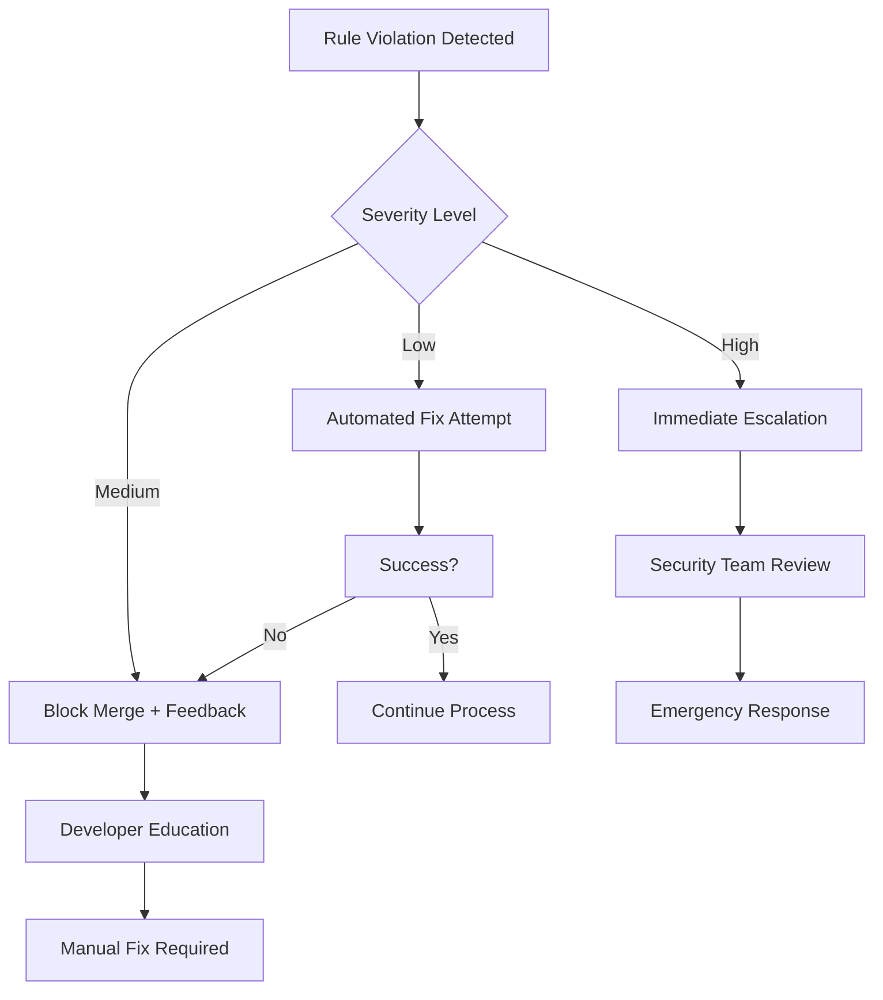

# FlowVision GitHub Rules Enforcement Strategy

## 🎯 Overview

This document outlines our comprehensive approach to ensuring all GitHub and source code management rules are consistently followed across the FlowVision project. Our enforcement strategy uses multiple layers of automation, human oversight, and continuous improvement.

## 🏗️ Multi-Layer Enforcement Architecture

```
┌─────────────────────────────────────────────────────────────┐
│                    PREVENTION LAYER                        │
├─────────────────────────────────────────────────────────────┤
│  • Pre-commit hooks        • IDE integration              │
│  • Branch protection       • Developer training           │
└─────────────────────────────────────────────────────────────┘
                             ↓
┌─────────────────────────────────────────────────────────────┐
│                    DETECTION LAYER                         │
├─────────────────────────────────────────────────────────────┤
│  • CI/CD pipeline checks   • Automated code review        │
│  • Security scanning       • Dependency auditing          │
└─────────────────────────────────────────────────────────────┘
                             ↓
┌─────────────────────────────────────────────────────────────┐
│                    CORRECTION LAYER                        │
├─────────────────────────────────────────────────────────────┤
│  • Automated fixes         • Human code review            │
│  • Immediate feedback      • Educational guidance         │
└─────────────────────────────────────────────────────────────┘
                             ↓
┌─────────────────────────────────────────────────────────────┐
│                    MONITORING LAYER                        │
├─────────────────────────────────────────────────────────────┤
│  • Compliance metrics      • Trend analysis               │
│  • Team performance        • Process improvement          │
└─────────────────────────────────────────────────────────────┘
```

## 🔧 Layer 1: Prevention (Stop Issues Before They Happen)

### 🛡️ Pre-Commit Automation

```json
// package.json - Already implemented
{
  "husky": {
    "hooks": {
      "pre-commit": "lint-staged",
      "commit-msg": "commitlint -E HUSKY_GIT_PARAMS",
      "pre-push": "npm test"
    }
  }
}
```

**What it prevents:**

- ❌ Bad commit messages
- ❌ Linting errors
- ❌ Failing tests
- ❌ TypeScript compilation errors

### 🔒 GitHub Repository Settings

```yaml
# Branch Protection Rules (Already configured)
main:
  required_status_checks:
    strict: true
    contexts:
      - 'CI/CD Pipeline/Lint and Type Check'
      - 'CI/CD Pipeline/Unit and Integration Tests'
      - 'CI/CD Pipeline/Security Scan'
      - 'CI/CD Pipeline/End-to-End Tests'
  enforce_admins: true
  required_pull_request_reviews:
    required_approving_review_count: 1
    dismiss_stale_reviews: true
  restrictions: null
```

**What it prevents:**

- ❌ Direct commits to main
- ❌ Merging without review
- ❌ Bypassing CI/CD checks
- ❌ Force pushing to protected branches

### 💻 IDE Integration

```json
// .vscode/settings.json - Recommended team settings
{
  "editor.formatOnSave": true,
  "editor.codeActionsOnSave": {
    "source.fixAll.eslint": true
  },
  "typescript.preferences.includePackageJsonAutoImports": "off",
  "git.inputValidation": "always",
  "git.inputValidationLength": 50,
  "git.inputValidationSubjectLength": 50
}
```

**What it prevents:**

- ❌ Inconsistent formatting
- ❌ Unused imports
- ❌ Long commit messages
- ❌ TypeScript errors during development

## 🔍 Layer 2: Detection (Catch Issues Early)

### 🤖 Automated CI/CD Checks

Our current pipeline already includes:

```yaml
# .github/workflows/ci.yml - Current implementation
jobs:
  lint-and-type-check:
    - ESLint validation
    - TypeScript compilation
    - Prettier formatting check

  unit-and-integration-tests:
    - Jest test suite
    - Coverage reporting
    - Database integration tests

  security-scan:
    - Dependency vulnerability scan
    - Secret detection
    - SAST analysis

  e2e-tests:
    - Cypress end-to-end tests
    - UI regression testing
```

### 📊 Code Quality Metrics

```yaml
# Additional quality gates to implement
quality-gates:
  code-coverage: >= 80%
  maintainability-index: >= 60
  technical-debt-ratio: <= 5%
  duplicated-lines: <= 3%
  cognitive-complexity: <= 15
```

### 🔍 Automated Code Review

```yaml
# CodeRabbit AI Review - Already active
automated-review:
  - Code style compliance
  - Security vulnerability detection
  - Performance anti-patterns
  - Documentation completeness
  - Test coverage gaps
```

## 🛠️ Layer 3: Correction (Fix Issues Immediately)

### ⚡ Automated Fixes

```bash
# Pre-commit hook auto-fixes
lint-staged:
  "*.{js,ts,tsx}": [
    "eslint --fix",
    "prettier --write"
  ]
  "*.{json,md}": [
    "prettier --write"
  ]
```

### 👥 Human Code Review Process

```markdown
# Review Checklist Template (Already in PR template)

## Code Quality Review

- [ ] Follows conventional commit format
- [ ] No console.log in production code
- [ ] Error handling implemented
- [ ] TypeScript types properly defined
- [ ] No hardcoded values

## Security Review

- [ ] No exposed secrets
- [ ] Input validation present
- [ ] Authentication checks in place
- [ ] SQL injection prevention

## Performance Review

- [ ] Database queries optimized
- [ ] No unnecessary re-renders
- [ ] Proper caching implemented
- [ ] Bundle size impact assessed
```

### 📚 Educational Feedback

```typescript
// Example automated comment system
const reviewComments = {
  conventionalCommits: {
    violation: "❌ Commit message doesn't follow conventional format",
    fix: 'Use: type(scope): description',
    example: 'feat(auth): add Google OAuth integration',
    documentation: 'https://conventionalcommits.org/',
  },

  security: {
    violation: '🔒 Potential security issue detected',
    fix: 'Never commit API keys or secrets',
    example: 'Use environment variables: process.env.API_KEY',
    documentation: './GITHUB_BEST_PRACTICES.md#secrets-management',
  },
};
```

## 📈 Layer 4: Monitoring (Track Compliance Over Time)

### 📊 Compliance Dashboard

```typescript
// Metrics to track
interface ComplianceMetrics {
  commitCompliance: {
    conventionalCommits: number; // % following format
    averageCommitSize: number; // lines changed per commit
    revertRate: number; // % of commits reverted
  };

  prCompliance: {
    reviewTime: number; // hours to first review
    mergeTime: number; // hours to merge
    conflictRate: number; // % PRs with conflicts
    checkPassRate: number; // % PRs passing all checks
  };

  codeQuality: {
    testCoverage: number; // % code coverage
    duplicateCode: number; // % duplicate code
    technicalDebt: number; // hours of technical debt
    securityIssues: number; // open security issues
  };

  teamPerformance: {
    ruleViolations: number; // violations per developer
    learningProgress: number; // training completion %
    contributionQuality: number; // quality score per dev
  };
}
```

### 📅 Regular Audits

```markdown
# Weekly Compliance Audit Checklist

## Code Quality

- [ ] Review failed CI/CD builds
- [ ] Check test coverage trends
- [ ] Identify recurring linting issues
- [ ] Assess security scan results

## Process Compliance

- [ ] Verify all PRs have reviews
- [ ] Check branch protection effectiveness
- [ ] Review commit message quality
- [ ] Audit secret management practices

## Team Performance

- [ ] Identify developers needing support
- [ ] Review training completion rates
- [ ] Assess rule violation patterns
- [ ] Plan improvement initiatives
```

## 🎓 Continuous Education & Improvement

### 📚 Developer Onboarding

```markdown
# New Developer Checklist

## Setup Phase

- [ ] Install required tools (Husky, ESLint, Prettier)
- [ ] Configure IDE with team settings
- [ ] Complete Git workflow training
- [ ] Read GITHUB_BEST_PRACTICES.md

## Practical Training

- [ ] Create first feature branch
- [ ] Make practice commit with proper format
- [ ] Submit practice PR following template
- [ ] Complete code review training

## Verification

- [ ] Pass pre-commit hook test
- [ ] Successfully merge first real PR
- [ ] Demonstrate conflict resolution
- [ ] Show understanding of emergency procedures
```

### 📈 Skills Development Program

```typescript
// Training modules
const trainingModules = [
  {
    name: 'Git Workflow Mastery',
    duration: '2 hours',
    topics: ['Branching', 'Merging', 'Conflict Resolution'],
    certification: true,
  },
  {
    name: 'Code Quality Standards',
    duration: '1.5 hours',
    topics: ['TypeScript', 'Testing', 'Documentation'],
    certification: true,
  },
  {
    name: 'Security Best Practices',
    duration: '1 hour',
    topics: ['Secret Management', 'Input Validation', 'Dependency Security'],
    certification: true,
  },
];
```

## 🚨 Escalation & Exception Handling

### 🆘 Emergency Procedures

```markdown
# When Rules Must Be Bypassed

## Approval Required From:

1. **Hotfix**: Lead Developer + Security Review
2. **Breaking Change**: Tech Lead + Product Owner
3. **Architecture Change**: Full Team Discussion

## Documentation Required:

- [ ] Reason for exception
- [ ] Risk assessment
- [ ] Mitigation plan
- [ ] Timeline for correction
```

### 📋 Violation Response Process



## 🔄 Continuous Improvement Cycle

### 📊 Monthly Rule Effectiveness Review

```markdown
# Review Questions

1. Which rules are most frequently violated?
2. What new violations patterns are emerging?
3. Which enforcement mechanisms are most effective?
4. What additional tooling do we need?
5. How can we improve developer experience?

# Action Items Template

- [ ] Update automation based on violation patterns
- [ ] Enhance training for frequently violated rules
- [ ] Add new detection mechanisms for emerging issues
- [ ] Simplify rules that are too complex
- [ ] Reward teams/individuals with best compliance
```

### 🎯 Success Metrics

```typescript
// Quarterly goals
const complianceTargets = {
  commitCompliance: 95, // % conventional commits
  prPassRate: 98, // % PRs passing all checks
  reviewTime: 4, // hours average review time
  ruleViolations: 2, // violations per dev per month
  testCoverage: 85, // % code coverage
  securityIssues: 0, // open high/critical issues
  trainingCompletion: 100, // % team training complete
};
```

## 🛠️ Implementation Timeline

### Phase 1: Foundation (Week 1-2)

- ✅ GitHub repository settings configured
- ✅ Pre-commit hooks implemented
- ✅ CI/CD pipeline enhanced
- ✅ Documentation created

### Phase 2: Monitoring (Week 3-4)

- [ ] Compliance dashboard setup
- [ ] Automated metrics collection
- [ ] Weekly audit process established
- [ ] Team training program launched

### Phase 3: Optimization (Week 5-8)

- [ ] Analyze first month of data
- [ ] Refine enforcement mechanisms
- [ ] Address common violation patterns
- [ ] Enhance developer tooling

### Phase 4: Maturity (Month 2+)

- [ ] Full automation of routine checks
- [ ] Predictive analysis of quality trends
- [ ] Advanced security scanning
- [ ] Cross-project rule standardization

## 📞 Support & Resources

### 🆘 Getting Help

- **Quick Questions**: Slack #dev-support channel
- **Rule Clarifications**: GitHub Discussions
- **Training Requests**: Learning & Development team
- **Emergency Bypass**: On-call tech lead

### 📚 Reference Materials

- [GITHUB_BEST_PRACTICES.md](./GITHUB_BEST_PRACTICES.md)
- [.cursorrules](./.cursorrules)
- [Conventional Commits](https://conventionalcommits.org/)
- [Team Coding Standards](./docs/coding-standards.md)

---

**Remember**: The goal is to make following the rules easier than breaking them, while maintaining a positive developer experience and high code quality.
