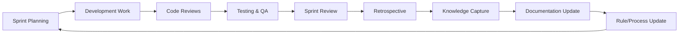

# 🧠 Continuous Learning Framework for FlowVision

## 🎯 PURPOSE

Establish a systematic continuous learning and knowledge management system that ensures all epic/story/sprint processes are tracked, lessons learned are captured, and all documentation stays current with real-time updates based on accomplishments and learnings.

---

## 🔄 CONTINUOUS LEARNING CYCLE

### Learning Integration Points



### Knowledge Capture Triggers

1. **Every Commit**: Capture technical decisions and learnings
2. **Every PR**: Document architectural choices and trade-offs
3. **Every Sprint Review**: Update velocity metrics and process improvements
4. **Every Retrospective**: Formalize lessons learned and action items
5. **Every Release**: Document deployment learnings and production insights

---

## 📊 EPIC/STORY/SPRINT METHODOLOGY ANALYSIS

### Current State Assessment

#### ✅ **Strengths Identified**

- **Structured Epic Breakdown**: Clear epic-to-story mapping with business value
- **Story Point Estimation**: Consistent story point system (1, 3, 5, 8, 13)
- **Velocity Tracking**: Historical data shows 45-58 story points per sprint
- **Expert Review Process**: Defined expert profiles and review gates
- **Documentation Framework**: Comprehensive knowledge tracking system

#### 🔍 **Gaps Identified**

- **Limited Retrospective Action Tracking**: No systematic follow-up on improvements
- **Manual Knowledge Updates**: Documentation updates not automated
- **Incomplete Learning Capture**: Ad-hoc capture of lessons learned
- **Disconnected Code/Process**: Git workflow not integrated with project management
- **Missing Predictive Analytics**: No forecasting based on historical patterns

### Enhanced Process Framework

#### **Epic Level** (Strategic Alignment)

```markdown
## Epic Template

### Epic: [Name]

**Business Value**: [Clear ROI statement]
**Success Metrics**: [Measurable outcomes]
**Timeline**: [Sprint range]
**Dependencies**: [Other epics/external dependencies]
**Risk Assessment**: [High/Medium/Low with mitigation]

### Learning Tracking

**Assumptions**: [Key assumptions to validate]
**Hypothesis**: [What we believe will happen]
**Success Criteria**: [How we'll measure success]
**Learning Goals**: [What we want to learn]
```

#### **Story Level** (Feature Implementation)

```markdown
## Story Template

### Story: [User story format]

**Acceptance Criteria**: [Clear, testable criteria]
**Story Points**: [1, 3, 5, 8, 13]
**Technical Approach**: [Implementation strategy]
**Definition of Done**: [Completion checklist]

### Learning Integration

**Technical Decisions**: [Key tech choices and rationale]
**Blockers Encountered**: [Issues and resolutions]
**Time Estimation Accuracy**: [Actual vs. estimated]
**Code Quality Metrics**: [Coverage, complexity, etc.]
```

#### **Sprint Level** (Execution & Learning)

```markdown
## Sprint Template

### Sprint [Number]: [Goal]

**Capacity**: [Story points]
**Team Composition**: [Available team members]
**Sprint Goal**: [Primary objective]
**Stories Committed**: [List with story points]

### Learning Capture

**Velocity Achieved**: [Actual story points completed]
**Impediments**: [Blockers and resolutions]
**Process Improvements**: [What worked/didn't work]
**Technical Debt**: [Debt incurred/resolved]
**Knowledge Gained**: [Key learnings]
```

---

## 🎯 AUTOMATED KNOWLEDGE CAPTURE SYSTEM

### Git Integration Points

#### **Commit-Level Learning**

- **Format**: `type(scope): description [learns: key-learning]`
- **Example**: `feat(ai): implement caching [learns: 70% cost reduction with Redis]`
- **Automation**: Parse commit messages for learning annotations

#### **PR-Level Documentation**

```markdown
## PR Template Enhancement

### Technical Changes

- [Change description]

### Architecture Decisions

- [Key decisions made and rationale]

### Learning Captured

- [What was learned during implementation]
- [Performance insights]
- [Security considerations]
- [Testing insights]

### Knowledge Base Updates

- [ ] Documentation updated
- [ ] ADR created (if architectural change)
- [ ] Process improvement identified
- [ ] Velocity data updated
```

#### **Release-Level Insights**

```markdown
## Release Learning Template

### Release: [Version]

**Features Delivered**: [List with story points]
**Performance Metrics**: [Response times, throughput]
**Production Issues**: [Bugs, performance, security]
**User Feedback**: [Adoption, satisfaction, issues]

### Strategic Learnings

**Process Improvements**: [What to change in process]
**Technical Debt Impact**: [Debt effect on velocity]
**Team Capacity Insights**: [Capacity planning learnings]
**Technology Insights**: [Tech stack performance]
```

---

## 📈 VELOCITY & PREDICTIVE ANALYTICS

### Enhanced Velocity Tracking

#### **Story Point Accuracy Analysis**

```javascript
// Automated story point accuracy tracking
const storyPointAccuracy = {
  sprint: 'Sprint 5',
  planned: 34,
  completed: 28,
  accuracy: 82.4,
  factors: {
    underestimated: ['AI integration complexity', 'Testing overhead'],
    overestimated: ['UI implementation', 'Database queries'],
    external: ['Third-party API delays'],
  },
};
```

#### **Velocity Trend Analysis**

- **3-Sprint Rolling Average**: Smooth out velocity variations
- **Capacity Factor Tracking**: Team member availability impact
- **Technical Debt Velocity Impact**: Correlation between debt and speed
- **Learning Curve Adjustment**: New technology adoption impact

#### **Predictive Sprint Planning**

```markdown
## Predictive Planning Algorithm

### Historical Data Points

- Last 5 sprints velocity: [52, 48, 56, 50, 54]
- Team composition changes: [+1 junior, -0.5 senior]
- Technical debt ratio: [15% → 12%]
- New technology adoption: [React 18, Prisma 5]

### Capacity Prediction

- **Base Velocity**: 52 story points (3-sprint average)
- **Team Adjustment**: -3 points (junior developer learning curve)
- **Tech Debt Improvement**: +2 points (reduced maintenance overhead)
- **New Tech Learning**: -4 points (React 18 learning curve)
- **Predicted Capacity**: 47 story points ± 5
```

---

## 🤖 AUTOMATED DOCUMENTATION SYSTEM

### Real-Time Documentation Updates

#### **Documentation Triggers**

1. **Sprint Completion**: Auto-update velocity metrics
2. **Story Completion**: Update feature documentation
3. **PR Merge**: Update technical documentation
4. **Release Deployment**: Update production documentation
5. **Retrospective**: Update process documentation

#### **Automated Update Scripts**

```bash
#!/bin/bash
# scripts/update-knowledge-base.sh

# Update velocity data from completed sprint
npm run velocity:update

# Extract learnings from recent commits
npm run learnings:extract

# Update process documentation
npm run docs:sync

# Generate retrospective insights
npm run retrospective:analyze

# Update Cursor rules with new learnings
npm run cursor:update-rules
```

#### **Knowledge Base Synchronization**

```javascript
// lib/knowledge-sync.js
export const syncKnowledgeBase = async () => {
  // Extract Git history insights
  const gitInsights = await extractGitLearnings();

  // Update velocity metrics
  await updateVelocityData();

  // Sync documentation
  await syncDocumentation();

  // Update process rules
  await updateProcessRules();

  // Generate learning reports
  await generateLearningReports();
};
```

---

## 🎯 SOURCE CODE MANAGEMENT INTEGRATION

### Git Workflow Enhancement

#### **Branch Naming Convention**

```
feature/epic-[epic-id]-story-[story-id]-[description]
bugfix/sprint-[sprint-id]-[issue-description]
hotfix/production-[severity]-[description]
experiment/[hypothesis]-[approach]
```

#### **Commit Message Standards**

```
type(scope): description [points: X] [learns: insight]

Examples:
feat(ai): implement response caching [points: 5] [learns: 70% API cost reduction]
fix(auth): resolve session timeout [points: 2] [learns: JWT refresh pattern needed]
refactor(db): optimize query performance [points: 3] [learns: index strategy impact]
```

#### **PR Review Integration**

```markdown
## Enhanced PR Review Checklist

### Technical Review

- [ ] Code follows established patterns
- [ ] Tests written and passing
- [ ] Performance impact assessed
- [ ] Security considerations addressed

### Learning Integration

- [ ] Technical decisions documented
- [ ] Performance insights captured
- [ ] Process improvements identified
- [ ] Knowledge base updated

### Sprint Integration

- [ ] Story acceptance criteria met
- [ ] Story points accuracy validated
- [ ] Velocity impact assessed
- [ ] Dependencies resolved
```

---

## 🔄 RETROSPECTIVE & CONTINUOUS IMPROVEMENT

### Enhanced Retrospective Framework

#### **Data-Driven Retrospectives**

```markdown
## Sprint [X] Retrospective Template

### Velocity Analysis

**Planned**: [X] story points
**Completed**: [Y] story points
**Accuracy**: [Y/X * 100]%
**Trend**: [Comparison with last 3 sprints]

### Learning Metrics

**Technical Learnings**: [Count and categories]
**Process Improvements**: [Identified and implemented]
**Blockers Resolved**: [Count and resolution time]
**Knowledge Gaps**: [Identified learning needs]

### What Went Well (Data-Backed)

- [Metric]: [Specific measurement]
- [Process]: [Quantified improvement]

### What Didn't Go Well (Evidence-Based)

- [Issue]: [Impact measurement]
- [Blocker]: [Time/velocity impact]

### Action Items (SMART Goals)

- [Action]: [Specific, Measurable, Timeline]
- [Process Change]: [Expected impact]

### Knowledge Updates Required

- [ ] Documentation updates
- [ ] Process rule changes
- [ ] Training needs identified
- [ ] Tool/technology evaluations
```

#### **Continuous Improvement Tracking**

```javascript
// Track improvement implementation
const improvementTracking = {
  sprintId: 'Sprint-5',
  actionItems: [
    {
      id: 'AI-001',
      description: 'Implement AI response caching',
      expectedImpact: '70% cost reduction',
      implementationDate: '2025-08-20',
      actualImpact: '72% cost reduction',
      status: 'completed',
      learnings: ['Redis cluster scaling', 'Cache invalidation patterns'],
    },
  ],
  processChanges: [
    {
      id: 'PROC-001',
      description: 'Add performance testing to PR review',
      expectedImpact: 'Reduce production performance issues',
      implementationDate: '2025-08-18',
      complianceRate: 95,
      status: 'adopted',
    },
  ],
};
```

---

## 📚 ENHANCED CURSOR RULES INTEGRATION

### Process-Aware Development Rules

#### **Sprint Context Awareness**

```markdown
## Sprint-Aware Development Rules

### Current Sprint Context

- **ALWAYS reference** current sprint goals when implementing features
- **ALWAYS update** story status when making related code changes
- **ALWAYS document** technical decisions that impact story points
- **ALWAYS consider** velocity impact of technical debt decisions

### Learning Integration Rules

- **ALWAYS capture** performance insights in commit messages
- **ALWAYS document** architectural decisions with ADRs
- **ALWAYS update** relevant documentation when process changes
- **ALWAYS track** time estimates vs. actual implementation time
```

#### **Automated Knowledge Rules**

```markdown
## Knowledge Management Rules

### Commit Requirements

- **MUST include** story point impact in commit messages for significant changes
- **MUST document** learning insights for complex implementations
- **MUST update** relevant documentation for architectural changes
- **MUST tag** commits with learning categories for automated processing

### PR Requirements

- **MUST complete** learning capture section in PR template
- **MUST update** velocity data if story point estimates change
- **MUST document** performance impact for optimization changes
- **MUST reference** sprint goals and success metrics
```

---

## 🎯 IMPLEMENTATION ROADMAP

### Phase 1: Foundation (Sprint 1)

- [ ] Implement enhanced commit message standards
- [ ] Create automated learning extraction scripts
- [ ] Update PR templates with learning sections
- [ ] Establish velocity tracking automation

### Phase 2: Integration (Sprint 2)

- [ ] Integrate Git workflow with project management
- [ ] Implement automated documentation updates
- [ ] Create retrospective data analytics
- [ ] Update Cursor rules with process awareness

### Phase 3: Analytics (Sprint 3)

- [ ] Implement predictive sprint planning
- [ ] Create learning trend analysis
- [ ] Develop process improvement tracking
- [ ] Build knowledge base search and retrieval

### Phase 4: Optimization (Sprint 4)

- [ ] Optimize automation workflows
- [ ] Enhance predictive accuracy
- [ ] Implement real-time learning insights
- [ ] Create team learning dashboards

---

## 📊 SUCCESS METRICS

### Process Improvement Metrics

- **Documentation Currency**: 95%+ documentation accuracy within 24 hours
- **Learning Capture Rate**: 90%+ of commits include learning annotations
- **Velocity Prediction Accuracy**: 85%+ sprint capacity prediction accuracy
- **Retrospective Action Completion**: 90%+ of action items implemented within 2 sprints

### Knowledge Management Metrics

- **Knowledge Retrieval Time**: <30 seconds to find relevant information
- **Process Compliance**: 95%+ adherence to enhanced development rules
- **Learning Application**: 80%+ of captured learnings applied in future work
- **Team Knowledge Growth**: Measurable skill progression across team members

### Development Velocity Metrics

- **Sprint Predictability**: ±10% variance in sprint completion
- **Technical Debt Ratio**: <15% of development time on debt
- **Story Point Accuracy**: 85%+ estimation accuracy
- **Cycle Time Improvement**: 20% reduction in story completion time

---

This framework establishes a comprehensive continuous learning system that integrates all aspects of our development process, ensuring knowledge is captured, shared, and applied systematically to improve our epic/story/sprint effectiveness.

_Framework established: August 2025_
_Maintained by: Project Management & Development Teams_
_Next review: Monthly optimization cycle_
