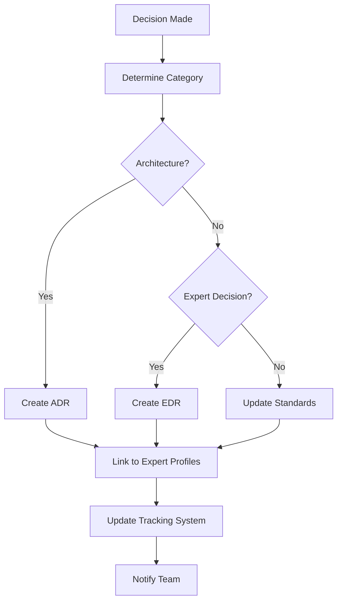
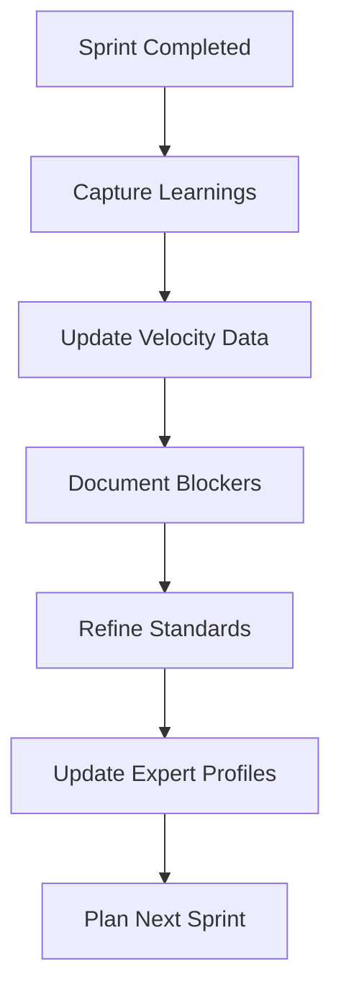

# FlowVision Knowledge Tracking System

## 🎯 PURPOSE

Comprehensive tracking system for all past learning, decisions, standards, and rules to enable seamless continuation of work regardless of conversation length or interruptions.

---

## 📚 **KNOWLEDGE CATEGORIES**

### **1. ARCHITECTURAL DECISIONS**

**Location**: `/docs/architecture/`
**Format**: Architecture Decision Records (ADRs)

```markdown
# ADR-001: Database Schema Design

**Date**: 2025-01-15
**Status**: ACCEPTED
**Context**: Need to establish relationships for systems enhancement
**Decision**: Use Prisma with PostgreSQL for type-safe queries
**Consequences**: Better type safety, automatic migrations, learning curve
**References**: EXPERT_PROFILES_SYSTEM.md - Technical Architect guidelines
```

### **2. DEVELOPMENT STANDARDS**

**Location**: `.cursorrules` + `/docs/development/`
**Components**:

- Coding conventions
- Git workflow requirements
- Testing standards
- Security practices
- AI integration patterns
- Folder organization standards
- Documentation maintenance procedures

### **3. SPRINT LEARNINGS**

**Location**: `SYSTEMS_ENHANCEMENT_EXECUTION_PLAN.md`
**Tracking**:

- Velocity actuals vs. estimates
- Blocker patterns and resolutions
- Story point accuracy
- Technical debt accumulation

### **4. EXPERT DECISIONS**

**Location**: `EXPERT_PROFILES_SYSTEM.md` + `/docs/decisions/`
**Format**: Expert Decision Records (EDRs)

```markdown
# EDR-001: Security Architecture Decision

**Expert**: Security Architect
**Date**: 2025-01-15
**Decision**: Implement role-based access control with JWT tokens
**Quality Gates**: All endpoints require authentication, audit logging enabled
**Validation**: Security scan passed, penetration test scheduled
```

### **5. TECHNICAL DEBT**

**Location**: `/docs/technical-debt/`
**Tracking**:

- Identified technical debt items
- Priority and impact assessment
- Resolution timeline
- Dependencies and blockers

---

## 🔄 **KNOWLEDGE MANAGEMENT WORKFLOWS**

### **DECISION CAPTURE WORKFLOW**



### **LEARNING INTEGRATION WORKFLOW**



---

## 📋 **TRACKING TEMPLATES**

### **SPRINT LEARNING TEMPLATE**

```markdown
# Sprint X Learning Summary

## Sprint Metrics

- **Planned Points**: 34
- **Completed Points**: 28
- **Velocity**: 28 points/2 weeks
- **Completion Rate**: 82%

## Key Learnings

1. **What Worked Well**:
   - AI integration faster than expected
   - Parallel development effective

2. **Challenges Encountered**:
   - Database migration complexity
   - Cross-component dependencies

3. **Process Improvements**:
   - Add database validation step
   - Earlier integration testing

## Technical Debt Identified

- Component prop drilling in system tags
- API response caching needed
- Test coverage gaps in AI modules

## Expert Consultations

- Technical Architect: Database schema optimization
- Security Architect: API security review
- QA Engineer: Test strategy refinement

## Next Sprint Adjustments

- Reduce story point estimates by 10%
- Add buffer for integration complexity
- Include security review checkpoints
```

### **DECISION IMPACT TEMPLATE**

```markdown
# Decision Impact Analysis

## Decision Summary

**Decision**: [Brief description]
**Date**: [YYYY-MM-DD]
**Expert**: [Relevant expert profile]

## Impact Assessment

- **Code Changes**: [Files/components affected]
- **Dependencies**: [What depends on this decision]
- **Timeline**: [Implementation timeline]
- **Risk**: [Low/Medium/High]

## Validation Criteria

- [ ] Expert quality gates met
- [ ] Tests updated
- [ ] Documentation updated
- [ ] Team notified

## Follow-up Actions

- [ ] Monitor implementation
- [ ] Collect feedback
- [ ] Adjust if needed
- [ ] Document lessons learned
```

---

## 🛠️ **AUTOMATION INTEGRATION**

### **BACKGROUND AGENTS FOR KNOWLEDGE TRACKING**

```typescript
// .cursor/agents/knowledge-tracking.ts
export const knowledgeTrackingAgent = {
  triggers: ['file:save:*.md', 'git:commit', 'github:issue:closed', 'github:pr:merged'],

  actions: [
    'extractDecisions',
    'updateKnowledgeBase',
    'linkToExpertProfiles',
    'generateLearningsSummary',
    'validateDocumentationCoverage',
  ],

  knowledgeExtraction: {
    decisions: /^(ADR|EDR)-\d+:/,
    learnings: /## (Learning|Lesson|Key Finding)/,
    standards: /## (Standard|Rule|Guideline)/,
    technicalDebt: /(TODO|FIXME|TECH_DEBT):/,
  },

  automation: {
    linkExpertProfiles: true,
    updateExecutionPlan: true,
    generateReports: 'weekly',
    validateCompleteness: true,
  },
};
```

### **CURSOR RULES INTEGRATION**

```markdown
# Add to .cursorrules

## Knowledge Tracking Framework

- **BEFORE major decisions**: Check existing ADRs and EDRs
- **DURING implementation**: Document decisions and learnings
- **AFTER completion**: Update knowledge base and expert profiles
- **WHEN blocked**: Document blockers and resolution approaches
- **FOR conflicts**: Reference past decisions and expert guidance

### Knowledge Capture Rules

- **ALWAYS create ADR** for architectural decisions
- **ALWAYS create EDR** for expert-guided decisions
- **ALWAYS update** execution plan with actual vs. estimated
- **ALWAYS document** technical debt when identified
- **ALWAYS link** decisions to expert profiles and quality gates
```

---

## 📊 **KNOWLEDGE METRICS**

### **COVERAGE METRICS**

- **Decision Coverage**: % of decisions documented
- **Learning Retention**: % of lessons applied in future sprints
- **Standard Adherence**: % of work following documented standards
- **Expert Utilization**: % of decisions using expert profiles

### **QUALITY METRICS**

- **Documentation Freshness**: Age of last update
- **Cross-Reference Accuracy**: Links between documents valid
- **Searchability**: Time to find relevant information
- **Completeness**: Required sections populated

### **IMPACT METRICS**

- **Onboarding Time**: Time for new team members to understand context
- **Decision Speed**: Time to make similar decisions in future
- **Context Recovery**: Time to resume after interruptions
- **Knowledge Reuse**: Frequency of referencing past decisions

---

## 🔍 **SEARCH AND RETRIEVAL**

### **SEMANTIC SEARCH INTEGRATION**

```typescript
// .cursor/agents/knowledge-search.ts
export const knowledgeSearchAgent = {
  indexedContent: ['ADRs', 'EDRs', 'Sprint learnings', 'Expert decisions', 'Standards updates'],

  searchCapabilities: {
    semantic: 'Find similar decisions and learnings',
    contextual: 'Search by project phase or component',
    temporal: 'Find decisions made in timeframe',
    expert: 'Search by expert profile involvement',
  },

  queryExamples: [
    'How did we handle authentication in previous sprints?',
    'What security decisions has the Security Architect made?',
    'Find learnings about AI integration performance',
    'Show technical debt related to database queries',
  ],
};
```

### **CONTEXT RECONSTRUCTION**

```markdown
# Context Reconstruction Checklist

When resuming work after interruption:

## Current State Assessment

- [ ] Check git branch and recent commits
- [ ] Review open PRs and issues
- [ ] Check current sprint progress in execution plan
- [ ] Identify any blocking items

## Recent Decisions Review

- [ ] Read latest ADRs and EDRs
- [ ] Check expert profile consultations
- [ ] Review recent learning summaries
- [ ] Understand current technical debt

## Next Steps Planning

- [ ] Identify immediate priorities
- [ ] Check dependencies and blockers
- [ ] Validate approach with expert profiles
- [ ] Update team on current status
```

---

## 🎯 **IMPLEMENTATION PHASES**

### **PHASE 1: FOUNDATION (Immediate)**

- Set up knowledge tracking templates
- Integrate with existing documents
- Create automation agents
- Train team on processes

### **PHASE 2: AUTOMATION (Week 1)**

- Implement background tracking agents
- Set up semantic search
- Create dashboard for metrics
- Integrate with development workflow

### **PHASE 3: OPTIMIZATION (Week 2)**

- Refine automation based on usage
- Enhance search capabilities
- Add predictive insights
- Create knowledge reuse recommendations

---

## 📈 **SUCCESS INDICATORS**

### **SHORT-TERM (1-2 weeks)**

- All decisions documented in standard format
- Automation agents capturing knowledge automatically
- Team using templates consistently
- Search functionality operational

### **MEDIUM-TERM (1 month)**

- Reduced onboarding time for new team members
- Faster decision-making using past learnings
- Improved sprint estimation accuracy
- Reduced repeated mistakes

### **LONG-TERM (3 months)**

- Knowledge base becomes primary reference
- Predictive insights from past patterns
- Automated knowledge recommendations
- Measurable improvement in delivery quality

---

This knowledge tracking system ensures that no learning, decision, or standard is lost, enabling seamless continuation of work regardless of interruptions or team changes.
